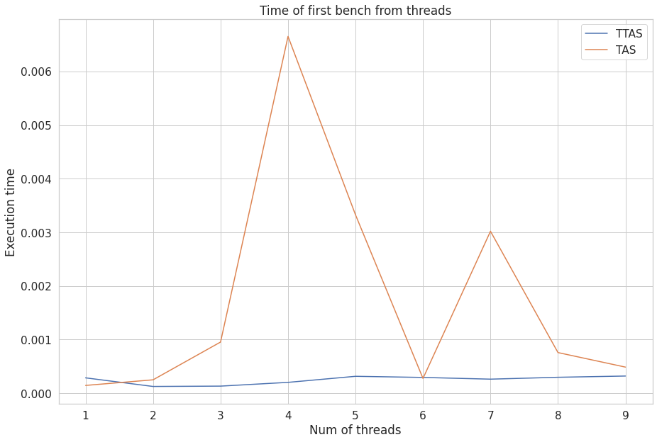
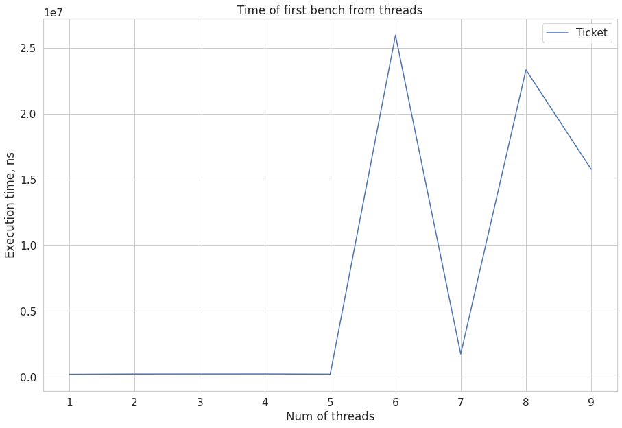
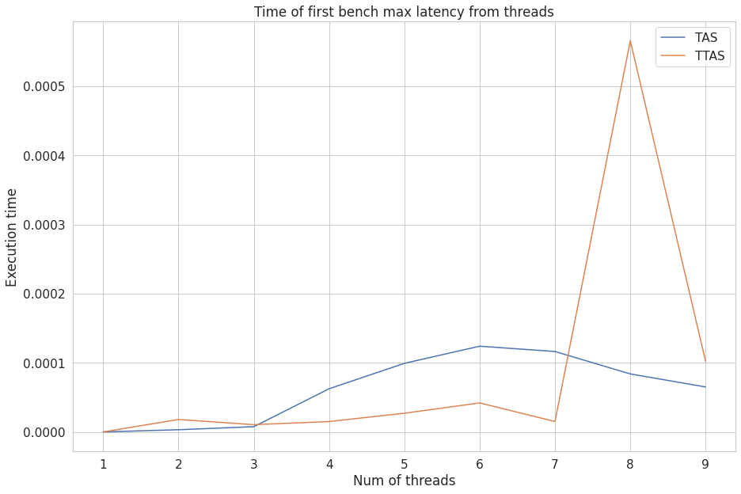
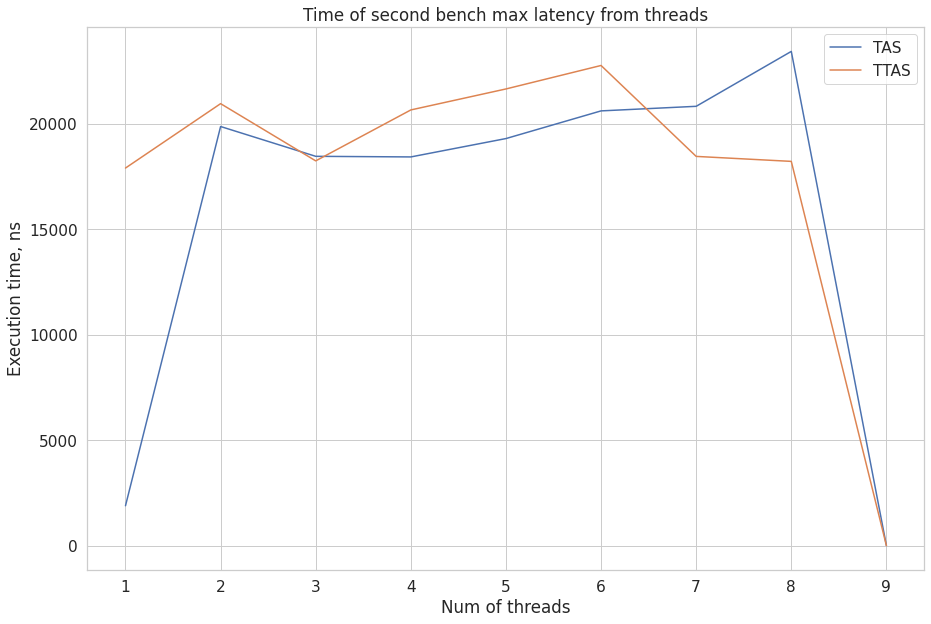

# Second task - Spinlock

I implemented 3 types of spinlock and 3 type of benchmarks. And there are results

## First benchmark - simple contention

I added two graphs because ticket lock is way more slow for a lot of threads.
It is execution time on one thread (cause there are more instructions we should use to achieve

## First benchmark - latency

I think that TTAS is way more stable than TAS on lot threads.

## Second benchmark - latency

